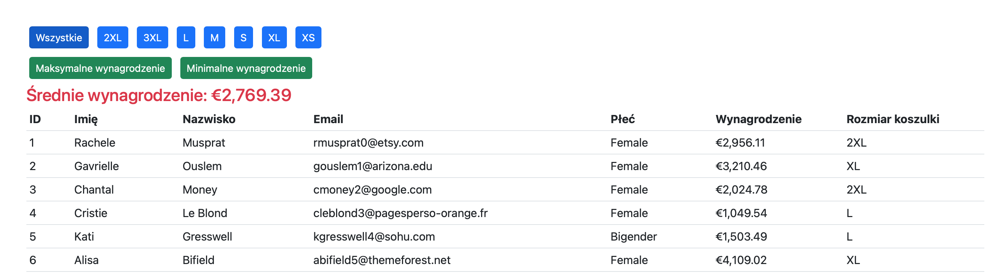
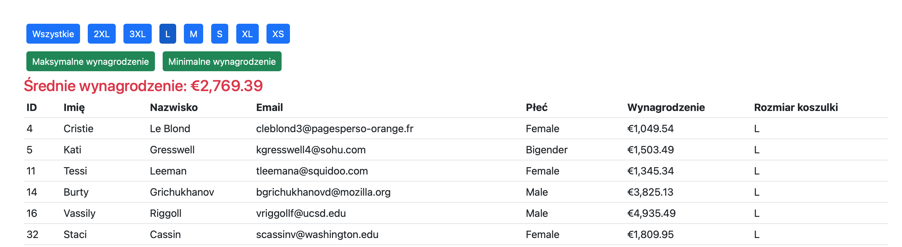
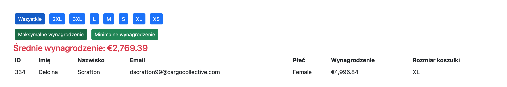
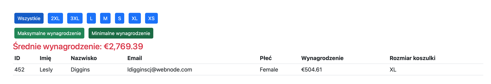

### Treść ćwiczenia
Z zastosowaniem biblioteki Flask napisz aplikację filtrującą dane. Przykładowy wygląd aplikacji przedstawiono na screenie poniżej. Dane zostały zapisane w pliku json.

### Wymagania
- wczytaj dane z pliku i wyświetl w tabeli
- przyciski do filtrowania danych umieść nad tabelą z prawidłowymi opisami pobieranymi automatycznie z wczytanych danych
- dodano funkcjonalność pozwalającą filtrować dane po rozmiarze koszulki
- po wybraniu odpowiednich przycisków są zwracane rekordy z minimalną lub maksymalną wartością wynagrodzenia oraz dodano wyświetlanie średniego wynagrodzenia pod przyciskami
- zastosowano formatowanie z wykorzystaniem Flask-BS4, wybrana opcja filtrowania zmienia się w odniesieniu do innych przycisków

